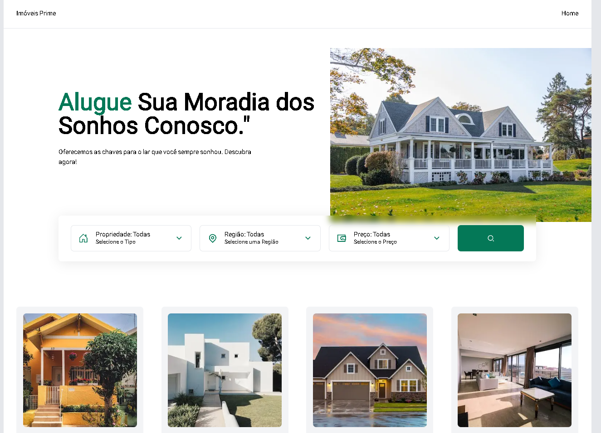
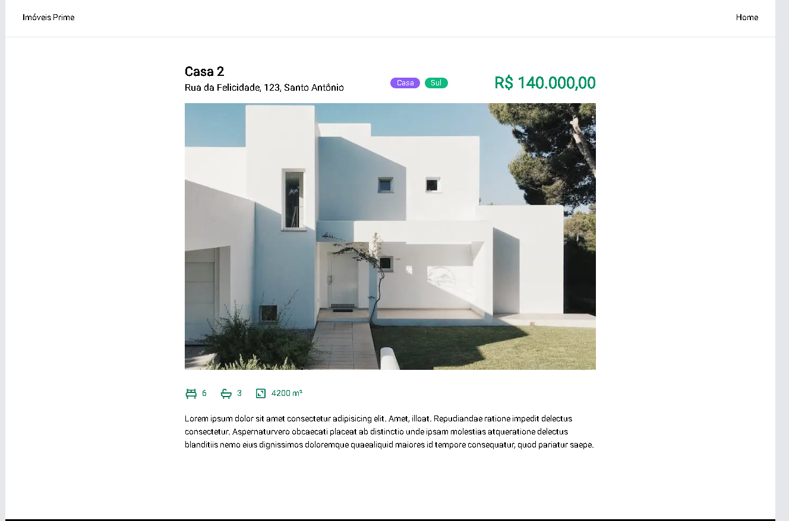

# Imóveis Prime

### Layout




### 🧠 About

Este projeto de site para uma imobiliária foi estruturado visando proporcionar uma experiência ágil e eficiente para os usuários em busca de propriedades. A página possui uma filtragem  por tipo, localização e faixa de preço. Cada propriedade possui uma página dedicada, com informações e detalhes específicos (quartos, banheiros, etc.).

### Core technologies

- Next.js
- React Icons
- TailwindCSS
- Typescript

### 🖥️ Installation

1. Clone this repo
```bash
https://github.com/delanoquirino/imobiliaria.git
```

2. Install dependencies
```bash
npm install
```

3. Run Frontend
```bash
npm run dev
```


